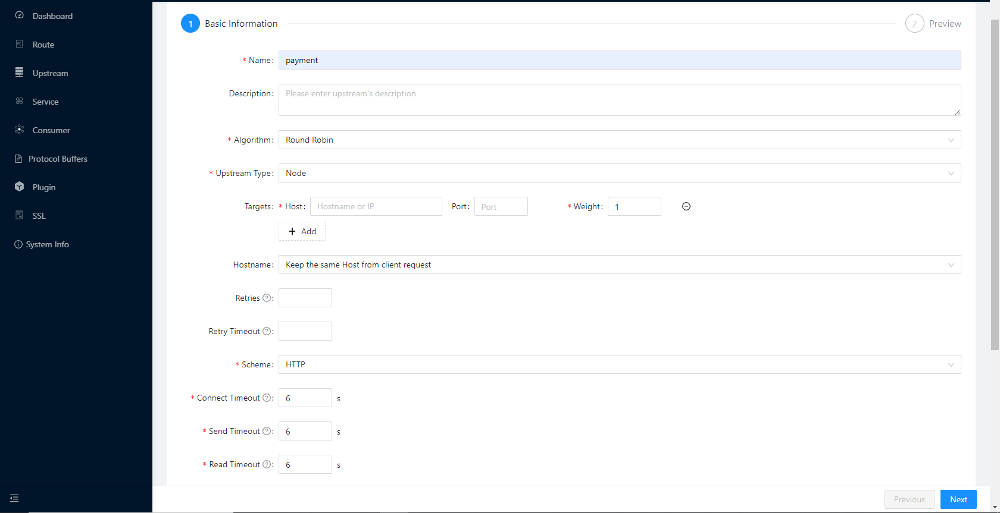

# API SIX

Apache [APISIX](https://apisix.apache.org) is the Api Gateway using in the project for routing traffic from different services, load balancing, user authentications and more. For development purpose we can use the docker [example](https://github.com/apache/apisix-docker/tree/master/example) provided by apisix.

Once APISIX is up and running we can use the [APISIX Dashboard](https://apisix.apache.org/docs/dashboard/USER_GUIDE/) for configuring the API Gateway as of now.

## Upstream

The upstream list contains the created upstream services (i.e., backend services) and allows load balancing and health checking of multiple target nodes of the upstream services. 

We can user APISIX Dashboard to configure upstreams

* Goto Upstreams menu and click on create

* Fill the basic details and click next

Enter name, host and port and rest of the details can be same as default and submit the page.

::: info Please note that host name should be name of the docker service and port should be the port within the container network. 
:::

## Route

Route is the entry point of a request, which defines the matching rules between a client request and a service. A route can be associated with a service (Service), an upstream (Upstream), a service can correspond to a set of routes, and a route can correspond to an upstream object (a set of backend service nodes), so each request matching to a route will be proxied by the gateway to the route-bound upstream service.

Route also can be created from dashboard.

* Goto Upstreams menu and click on create

* Fill the details and click next

Need to enter name, path, request methods and keep the host empty in test enviornment.
Path will the url path which is used to identity which service is to triger.

For example the path `/api/payment/*` will route all the requests which is comming to the path to the upstream which we defining in the route.

Also we can select which all request methods should be accepted by the route.

* Select Upstream

In the next stage we can select an already created upstream from the list or create a new on there.

Select upstream and submit.

Once route and upstream are configured the routes will be available in apisix endpoint.
